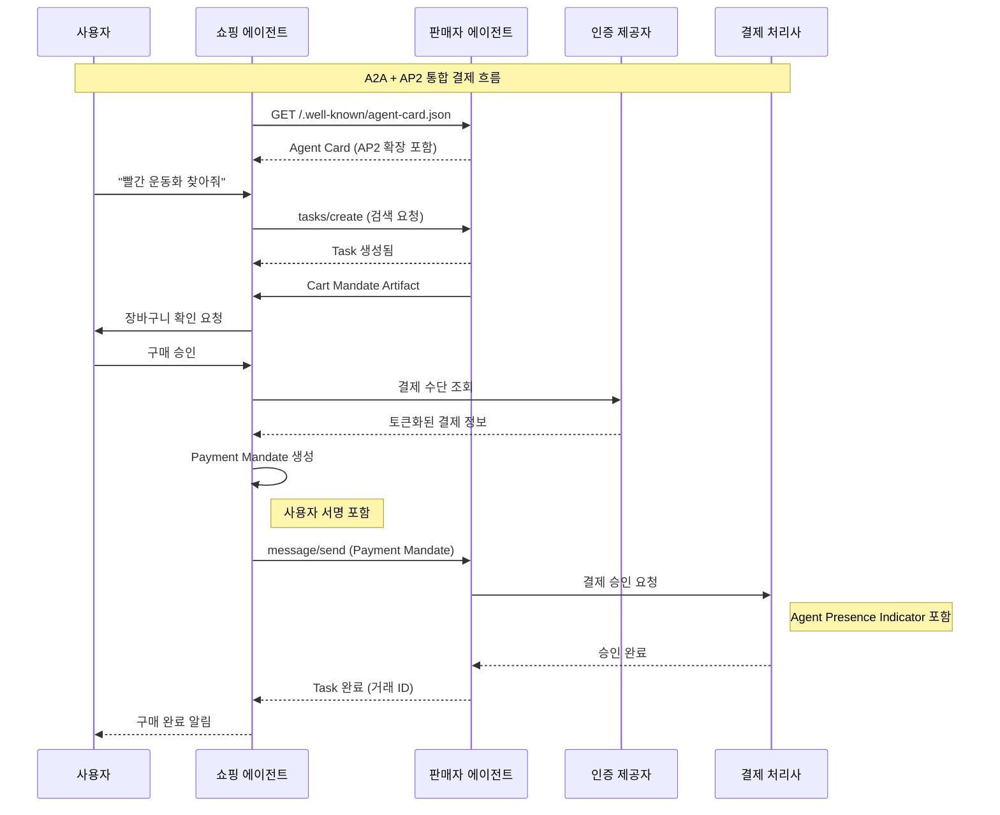

# 에이전트 상거래의 미래와 Google AP2 - 코드 예제

## 목차
1. [AP2 Agent Card 예제](#1-ap2-agent-card-예제)
2. [AP2 결제 흐름 구현](#2-ap2-결제-흐름-구현)
3. [A2A + AP2 통합 예제](#3-a2a--ap2-통합-예제)
4. [실용적인 사용 사례 데모](#4-실용적인-사용-사례-데모)

---

## 1. AP2 Agent Card 예제

### 1.1 Agent Card JSON 스키마

Agent Card는 에이전트의 신원, 기능, 보안 요구사항을 정의하는 JSON 매니페스트이다.
일반적으로 `/.well-known/agent-card.json` 엔드포인트에서 제공된다.

```json
{
  "$schema": "http://json-schema.org/draft-07/schema#",
  "title": "A2A Agent Card Schema",
  "description": "에이전트의 기능과 인터페이스를 정의하는 스키마",
  "type": "object",
  "required": ["protocolVersion", "name", "url"],
  "properties": {
    "protocolVersion": {
      "type": "string",
      "description": "A2A 프로토콜 버전",
      "example": "0.3.0"
    },
    "name": {
      "type": "string",
      "description": "에이전트 이름"
    },
    "description": {
      "type": "string",
      "description": "에이전트 기능 설명"
    },
    "url": {
      "type": "string",
      "format": "uri",
      "description": "에이전트 엔드포인트 URL"
    },
    "preferredTransport": {
      "type": "string",
      "enum": ["JSONRPC", "GRPC", "HTTP+JSON"],
      "description": "선호하는 통신 프로토콜"
    },
    "provider": {
      "type": "object",
      "properties": {
        "organization": { "type": "string" },
        "url": { "type": "string", "format": "uri" }
      }
    },
    "capabilities": {
      "type": "object",
      "properties": {
        "streaming": { "type": "boolean" },
        "pushNotifications": { "type": "boolean" },
        "stateTransitionHistory": { "type": "boolean" }
      }
    },
    "securitySchemes": {
      "type": "object",
      "description": "지원하는 인증 방식"
    },
    "skills": {
      "type": "array",
      "items": {
        "type": "object",
        "properties": {
          "id": { "type": "string" },
          "name": { "type": "string" },
          "description": { "type": "string" },
          "tags": { "type": "array", "items": { "type": "string" } }
        }
      }
    },
    "extensions": {
      "type": "array",
      "description": "지원하는 프로토콜 확장 (AP2 등)",
      "items": {
        "type": "object",
        "properties": {
          "uri": { "type": "string" },
          "description": { "type": "string" }
        }
      }
    }
  }
}
```

### 1.2 결제 기능이 포함된 Agent Card 예제

다음은 AP2 결제 기능을 지원하는 판매자 에이전트(Merchant Agent)의 Agent Card 예제이다.

```json
{
  "protocolVersion": "0.3.0",
  "name": "E-Commerce Merchant Agent",
  "description": "전자상거래 상품 검색, 주문, 결제를 처리하는 판매자 에이전트",
  "url": "https://merchant-agent.example.com/a2a/v1",
  "preferredTransport": "JSONRPC",

  "additionalInterfaces": [
    {
      "url": "https://merchant-agent.example.com/a2a/v1",
      "transport": "JSONRPC"
    },
    {
      "url": "https://merchant-agent.example.com/a2a/grpc",
      "transport": "GRPC"
    }
  ],

  "provider": {
    "organization": "Example Commerce Inc.",
    "url": "https://www.example-commerce.com"
  },

  "capabilities": {
    "streaming": true,
    "pushNotifications": true,
    "stateTransitionHistory": true
  },

  "securitySchemes": {
    "oauth2": {
      "type": "oauth2",
      "flows": {
        "authorizationCode": {
          "authorizationUrl": "https://auth.example.com/authorize",
          "tokenUrl": "https://auth.example.com/token",
          "scopes": {
            "read:products": "상품 정보 조회",
            "write:orders": "주문 생성",
            "process:payments": "결제 처리"
          }
        }
      }
    },
    "apiKey": {
      "type": "apiKey",
      "in": "header",
      "name": "X-API-Key"
    }
  },

  "security": [
    { "oauth2": ["read:products", "write:orders"] }
  ],

  "defaultInputModes": ["application/json", "text/plain"],
  "defaultOutputModes": ["application/json"],

  "skills": [
    {
      "id": "product-search",
      "name": "상품 검색",
      "description": "카탈로그에서 상품을 검색하고 가격/재고 정보를 제공",
      "tags": ["search", "products", "catalog"],
      "examples": [
        "빨간색 운동화를 찾아줘",
        "100달러 이하의 노트북 추천해줘"
      ],
      "inputModes": ["application/json", "text/plain"],
      "outputModes": ["application/json"]
    },
    {
      "id": "order-management",
      "name": "주문 관리",
      "description": "장바구니 구성, 주문 생성, 주문 상태 조회",
      "tags": ["orders", "cart", "checkout"],
      "examples": [
        "장바구니에 상품 추가해줘",
        "주문 상태를 확인해줘"
      ],
      "inputModes": ["application/json"],
      "outputModes": ["application/json"]
    },
    {
      "id": "payment-processing",
      "name": "결제 처리",
      "description": "AP2 프로토콜을 통한 안전한 결제 처리",
      "tags": ["payment", "checkout", "ap2"],
      "examples": [
        "이 주문에 대한 결제를 진행해줘"
      ],
      "inputModes": ["application/json"],
      "outputModes": ["application/json"]
    }
  ],

  "extensions": [
    {
      "uri": "https://google-a2a.github.io/A2A/extensions/payments/v1",
      "description": "AP2 결제 프로토콜 지원"
    },
    {
      "uri": "https://x402.org/protocol/v1",
      "description": "x402 암호화폐 결제 지원"
    }
  ],

  "paymentCapabilities": {
    "supportedMethods": ["CARD", "BANK_TRANSFER", "CRYPTO"],
    "supportedCurrencies": ["USD", "EUR", "KRW"],
    "supportedCryptoAssets": ["USDC", "ETH"],
    "supportedNetworks": ["base", "ethereum"],
    "refundPolicy": {
      "supported": true,
      "maxRefundPeriodDays": 30
    },
    "mandateTypes": ["CartMandate", "IntentMandate", "PaymentMandate"]
  }
}
```

### 1.3 쇼핑 에이전트 Agent Card 예제

사용자를 대신하여 쇼핑을 수행하는 클라이언트 에이전트의 Agent Card이다.

```json
{
  "protocolVersion": "0.3.0",
  "name": "Personal Shopping Agent",
  "description": "사용자를 대신하여 상품을 검색하고 구매를 수행하는 개인 쇼핑 에이전트",
  "url": "https://shopping-agent.example.com/a2a/v1",
  "preferredTransport": "JSONRPC",

  "provider": {
    "organization": "AI Shopping Services",
    "url": "https://www.ai-shopping.com"
  },

  "capabilities": {
    "streaming": true,
    "pushNotifications": true,
    "stateTransitionHistory": true
  },

  "securitySchemes": {
    "bearerAuth": {
      "type": "http",
      "scheme": "bearer",
      "bearerFormat": "JWT"
    }
  },

  "skills": [
    {
      "id": "price-monitoring",
      "name": "가격 모니터링",
      "description": "특정 상품의 가격을 모니터링하고 목표 가격 도달 시 알림",
      "tags": ["price", "monitoring", "alerts"]
    },
    {
      "id": "autonomous-purchase",
      "name": "자율 구매",
      "description": "사전 설정된 조건에 따라 자동으로 구매 수행",
      "tags": ["purchase", "autonomous", "intent"]
    },
    {
      "id": "multi-vendor-compare",
      "name": "다중 판매자 비교",
      "description": "여러 판매자의 가격과 조건을 비교하여 최적의 옵션 제안",
      "tags": ["compare", "vendors", "pricing"]
    }
  ],

  "extensions": [
    {
      "uri": "https://google-a2a.github.io/A2A/extensions/payments/v1",
      "description": "AP2 결제 프로토콜 지원"
    }
  ],

  "agentCredentials": {
    "credentialProvider": "https://credentials.example.com",
    "supportedMandates": ["IntentMandate", "CartMandate"],
    "userAuthenticationRequired": true,
    "hardwareKeySupported": true
  }
}
```

---

## 2. AP2 결제 흐름 구현

### 2.1 Mandate 데이터 구조

#### Intent Mandate (의도 위임장)

Human-Not-Present 시나리오에서 사용자의 구매 의도를 정의한다.

```json
{
  "ap2.mandates.IntentMandate": {
    "user_cart_confirmation_required": false,
    "natural_language_description": "120달러 이하의 빨간색 나이키 운동화를 구매해줘",
    "merchants": ["nike.com", "footlocker.com"],
    "skus": null,
    "required_refundability": true,
    "intent_expiry": "2026-02-01T00:00:00Z",
    "spending_limits": {
      "max_single_transaction": {
        "currency": "USD",
        "value": 150.0
      },
      "max_daily_total": {
        "currency": "USD",
        "value": 500.0
      }
    },
    "approved_categories": ["footwear", "sportswear"],
    "payment_methods": ["CARD"],
    "user_signature": "eyJhbGciOiJFUzI1NksiLCJraWQiOiJkaWQ6ZXhhbXBsZTp1c2VyMTIzIn0..."
  }
}
```

#### Cart Mandate (장바구니 위임장)

Human-Present 시나리오에서 최종 장바구니 내용과 결제 요청을 정의한다.

```json
{
  "ap2.mandates.CartMandate": {
    "contents": {
      "id": "cart_nike_shoes_001",
      "user_signature_required": true,
      "payment_request": {
        "method_data": [
          {
            "supported_methods": "CARD",
            "data": {
              "payment_processor_url": "https://payment.example.com/process"
            }
          }
        ],
        "details": {
          "id": "order_nike_001",
          "displayItems": [
            {
              "label": "Nike Air Max 90 (Red, Size 10)",
              "amount": {
                "currency": "USD",
                "value": 120.0
              },
              "pending": false
            },
            {
              "label": "배송비",
              "amount": {
                "currency": "USD",
                "value": 5.99
              },
              "pending": false
            }
          ],
          "shipping_options": [
            {
              "id": "standard",
              "label": "표준 배송 (3-5일)",
              "amount": { "currency": "USD", "value": 5.99 },
              "selected": true
            },
            {
              "id": "express",
              "label": "익스프레스 배송 (1-2일)",
              "amount": { "currency": "USD", "value": 15.99 },
              "selected": false
            }
          ],
          "total": {
            "label": "총 결제 금액",
            "amount": {
              "currency": "USD",
              "value": 125.99
            },
            "pending": false
          }
        },
        "options": {
          "requestPayerName": true,
          "requestPayerEmail": true,
          "requestPayerPhone": false,
          "requestShipping": true,
          "shippingType": "shipping"
        }
      }
    },
    "merchant_signature": "sig_merchant_nike_abc123",
    "timestamp": "2026-01-25T10:30:00Z"
  }
}
```

#### Payment Mandate (결제 위임장)

실제 결제 승인에 사용되는 최소한의 자격 증명이다.

```json
{
  "ap2.mandates.PaymentMandate": {
    "payment_mandate_contents": {
      "payment_mandate_id": "pm_nike_001",
      "payment_details_id": "order_nike_001",
      "payment_details_total": {
        "label": "총 결제 금액",
        "amount": {
          "currency": "USD",
          "value": 125.99
        },
        "pending": false,
        "refund_period": 30
      },
      "payment_response": {
        "request_id": "order_nike_001",
        "method_name": "CARD",
        "details": {
          "token": "tok_visa_4242424242424242",
          "tokenized": true
        },
        "shipping_address": {
          "recipient": "Hong Gildong",
          "addressLine": ["123 Main Street", "Apt 4B"],
          "city": "Seoul",
          "region": "Seoul",
          "country": "KR",
          "postalCode": "06164"
        },
        "payer_name": "Hong Gildong",
        "payer_email": "hong@example.com"
      },
      "merchant_agent": "NikeMerchantAgent",
      "timestamp": "2026-01-25T10:35:00Z"
    },
    "user_authorization": "eyJhbGciOiJFUzI1NksiLCJraWQiOiJkaWQ6ZXhhbXBsZTp1c2VyMTIzIn0...",
    "agent_presence_indicator": {
      "agent_initiated": true,
      "human_present": true,
      "agent_id": "shopping-agent-001",
      "agent_provider": "AI Shopping Services"
    }
  }
}
```

### 2.2 TypeScript AP2 클라이언트 구현

```typescript
// ap2-client.ts
// AP2 프로토콜 클라이언트 기본 구현

import { v4 as uuidv4 } from 'uuid';

// ============================================================
// 타입 정의
// ============================================================

interface Amount {
  currency: string;
  value: number;
}

interface DisplayItem {
  label: string;
  amount: Amount;
  pending?: boolean;
}

interface PaymentMethodData {
  supported_methods: string;
  data: {
    payment_processor_url: string;
  };
}

interface PaymentDetails {
  id: string;
  displayItems: DisplayItem[];
  shipping_options?: ShippingOption[];
  total: DisplayItem;
}

interface ShippingOption {
  id: string;
  label: string;
  amount: Amount;
  selected: boolean;
}

interface PaymentRequest {
  method_data: PaymentMethodData[];
  details: PaymentDetails;
  options: PaymentOptions;
}

interface PaymentOptions {
  requestPayerName: boolean;
  requestPayerEmail: boolean;
  requestPayerPhone: boolean;
  requestShipping: boolean;
  shippingType?: string;
}

// Intent Mandate 타입
interface IntentMandate {
  user_cart_confirmation_required: boolean;
  natural_language_description: string;
  merchants?: string[];
  skus?: string[];
  required_refundability: boolean;
  intent_expiry: string;
  spending_limits?: SpendingLimits;
  approved_categories?: string[];
  payment_methods?: string[];
  user_signature?: string;
}

interface SpendingLimits {
  max_single_transaction?: Amount;
  max_daily_total?: Amount;
}

// Cart Mandate 타입
interface CartMandateContents {
  id: string;
  user_signature_required: boolean;
  payment_request: PaymentRequest;
}

interface CartMandate {
  contents: CartMandateContents;
  merchant_signature: string;
  timestamp: string;
}

// Payment Mandate 타입
interface PaymentMandateContents {
  payment_mandate_id: string;
  payment_details_id: string;
  payment_details_total: DisplayItem & { refund_period?: number };
  payment_response: PaymentResponse;
  merchant_agent: string;
  timestamp: string;
}

interface PaymentResponse {
  request_id: string;
  method_name: string;
  details: { token: string; tokenized?: boolean };
  shipping_address?: ShippingAddress;
  payer_name?: string;
  payer_email?: string;
  payer_phone?: string;
}

interface ShippingAddress {
  recipient: string;
  addressLine: string[];
  city: string;
  region: string;
  country: string;
  postalCode: string;
}

interface PaymentMandate {
  payment_mandate_contents: PaymentMandateContents;
  user_authorization: string;
  agent_presence_indicator?: AgentPresenceIndicator;
}

interface AgentPresenceIndicator {
  agent_initiated: boolean;
  human_present: boolean;
  agent_id: string;
  agent_provider: string;
}

// A2A 메시지 타입
interface A2AMessage {
  messageId: string;
  contextId: string;
  taskId: string;
  role: 'user' | 'agent';
  parts: MessagePart[];
}

interface MessagePart {
  kind: 'text' | 'data';
  text?: string;
  data?: Record<string, unknown>;
}

// ============================================================
// AP2 클라이언트 클래스
// ============================================================

class AP2Client {
  private baseUrl: string;
  private authToken: string;
  private agentId: string;

  constructor(config: { baseUrl: string; authToken: string; agentId: string }) {
    this.baseUrl = config.baseUrl;
    this.authToken = config.authToken;
    this.agentId = config.agentId;
  }

  // ----------------------------------------------------------
  // Intent Mandate 생성 (Human-Not-Present 시나리오)
  // ----------------------------------------------------------
  createIntentMandate(params: {
    description: string;
    merchants?: string[];
    maxAmount: Amount;
    expiryHours: number;
    categories?: string[];
    requireRefund?: boolean;
  }): IntentMandate {
    const expiry = new Date();
    expiry.setHours(expiry.getHours() + params.expiryHours);

    return {
      user_cart_confirmation_required: false,
      natural_language_description: params.description,
      merchants: params.merchants,
      skus: null,
      required_refundability: params.requireRefund ?? true,
      intent_expiry: expiry.toISOString(),
      spending_limits: {
        max_single_transaction: params.maxAmount,
      },
      approved_categories: params.categories,
      payment_methods: ['CARD'],
    };
  }

  // ----------------------------------------------------------
  // Cart Mandate 생성 (Human-Present 시나리오)
  // ----------------------------------------------------------
  createCartMandate(params: {
    cartId: string;
    orderId: string;
    items: DisplayItem[];
    shippingOptions?: ShippingOption[];
    paymentProcessorUrl: string;
    requireUserSignature?: boolean;
  }): CartMandate {
    // 총액 계산
    const totalValue = params.items.reduce(
      (sum, item) => sum + item.amount.value,
      0
    );
    const currency = params.items[0]?.amount.currency || 'USD';

    return {
      contents: {
        id: params.cartId,
        user_signature_required: params.requireUserSignature ?? true,
        payment_request: {
          method_data: [
            {
              supported_methods: 'CARD',
              data: {
                payment_processor_url: params.paymentProcessorUrl,
              },
            },
          ],
          details: {
            id: params.orderId,
            displayItems: params.items,
            shipping_options: params.shippingOptions,
            total: {
              label: 'Total',
              amount: { currency, value: totalValue },
              pending: false,
            },
          },
          options: {
            requestPayerName: true,
            requestPayerEmail: true,
            requestPayerPhone: false,
            requestShipping: true,
            shippingType: 'shipping',
          },
        },
      },
      merchant_signature: this.signMandate(params.cartId),
      timestamp: new Date().toISOString(),
    };
  }

  // ----------------------------------------------------------
  // Payment Mandate 생성
  // ----------------------------------------------------------
  createPaymentMandate(params: {
    cartMandate: CartMandate;
    paymentToken: string;
    shippingAddress: ShippingAddress;
    payerInfo: { name: string; email: string };
    userAuthorization: string;
    humanPresent: boolean;
  }): PaymentMandate {
    const { details } = params.cartMandate.contents.payment_request;

    return {
      payment_mandate_contents: {
        payment_mandate_id: `pm_${uuidv4()}`,
        payment_details_id: details.id,
        payment_details_total: {
          ...details.total,
          refund_period: 30,
        },
        payment_response: {
          request_id: details.id,
          method_name: 'CARD',
          details: {
            token: params.paymentToken,
            tokenized: true,
          },
          shipping_address: params.shippingAddress,
          payer_name: params.payerInfo.name,
          payer_email: params.payerInfo.email,
        },
        merchant_agent: 'MerchantAgent',
        timestamp: new Date().toISOString(),
      },
      user_authorization: params.userAuthorization,
      agent_presence_indicator: {
        agent_initiated: true,
        human_present: params.humanPresent,
        agent_id: this.agentId,
        agent_provider: 'AI Shopping Services',
      },
    };
  }

  // ----------------------------------------------------------
  // A2A 메시지로 래핑
  // ----------------------------------------------------------
  wrapInA2AMessage(
    mandate: IntentMandate | CartMandate | PaymentMandate,
    mandateType: 'IntentMandate' | 'CartMandate' | 'PaymentMandate',
    contextId: string,
    taskId: string
  ): A2AMessage {
    const mandateKey = `ap2.mandates.${mandateType}`;

    return {
      messageId: uuidv4(),
      contextId,
      taskId,
      role: 'user',
      parts: [
        {
          kind: 'data',
          data: {
            [mandateKey]: mandate,
          },
        },
      ],
    };
  }

  // ----------------------------------------------------------
  // 판매자 에이전트에 결제 요청 전송
  // ----------------------------------------------------------
  async sendPaymentRequest(
    merchantUrl: string,
    paymentMandate: PaymentMandate,
    contextId: string,
    taskId: string
  ): Promise<{ success: boolean; transactionId?: string; error?: string }> {
    const message = this.wrapInA2AMessage(
      paymentMandate,
      'PaymentMandate',
      contextId,
      taskId
    );

    try {
      const response = await fetch(`${merchantUrl}/a2a/v1`, {
        method: 'POST',
        headers: {
          'Content-Type': 'application/json',
          Authorization: `Bearer ${this.authToken}`,
        },
        body: JSON.stringify({
          jsonrpc: '2.0',
          id: uuidv4(),
          method: 'message/send',
          params: { message },
        }),
      });

      const result = await response.json();

      if (result.error) {
        return { success: false, error: result.error.message };
      }

      return {
        success: true,
        transactionId: result.result?.transactionId,
      };
    } catch (error) {
      return {
        success: false,
        error: error instanceof Error ? error.message : 'Unknown error',
      };
    }
  }

  // ----------------------------------------------------------
  // Mandate 서명 (실제 구현에서는 암호화 키 사용)
  // ----------------------------------------------------------
  private signMandate(data: string): string {
    // 실제 구현에서는 ECDSA 서명 사용
    // 여기서는 예시로 간단한 해시 사용
    return `sig_${Buffer.from(data).toString('base64').slice(0, 20)}`;
  }
}

// ============================================================
// 사용 예제
// ============================================================

async function exampleUsage() {
  // 클라이언트 초기화
  const client = new AP2Client({
    baseUrl: 'https://shopping-agent.example.com',
    authToken: 'your-auth-token',
    agentId: 'shopping-agent-001',
  });

  // 1. Intent Mandate 생성 (자동 구매 조건 설정)
  const intentMandate = client.createIntentMandate({
    description: '120달러 이하의 빨간색 나이키 운동화를 구매해줘',
    merchants: ['nike.com', 'footlocker.com'],
    maxAmount: { currency: 'USD', value: 150 },
    expiryHours: 72,
    categories: ['footwear', 'sportswear'],
    requireRefund: true,
  });

  console.log('Intent Mandate 생성됨:', intentMandate);

  // 2. Cart Mandate 생성 (장바구니 확정)
  const cartMandate = client.createCartMandate({
    cartId: 'cart_001',
    orderId: 'order_001',
    items: [
      {
        label: 'Nike Air Max 90 (Red)',
        amount: { currency: 'USD', value: 120 },
      },
      {
        label: '배송비',
        amount: { currency: 'USD', value: 5.99 },
      },
    ],
    paymentProcessorUrl: 'https://payment.example.com/process',
  });

  console.log('Cart Mandate 생성됨:', cartMandate);

  // 3. Payment Mandate 생성 및 결제 요청
  const paymentMandate = client.createPaymentMandate({
    cartMandate,
    paymentToken: 'tok_visa_4242424242424242',
    shippingAddress: {
      recipient: 'Hong Gildong',
      addressLine: ['123 Main Street'],
      city: 'Seoul',
      region: 'Seoul',
      country: 'KR',
      postalCode: '06164',
    },
    payerInfo: { name: 'Hong Gildong', email: 'hong@example.com' },
    userAuthorization: 'user-signature-token',
    humanPresent: true,
  });

  // 4. 결제 요청 전송
  const result = await client.sendPaymentRequest(
    'https://merchant-agent.example.com',
    paymentMandate,
    'context_001',
    'task_001'
  );

  console.log('결제 결과:', result);
}

export { AP2Client, IntentMandate, CartMandate, PaymentMandate };
```

### 2.3 Python AP2 클라이언트 구현

```python
# ap2_client.py
# AP2 프로토콜 클라이언트 Python 구현

import uuid
import json
import httpx
from datetime import datetime, timedelta
from dataclasses import dataclass, field, asdict
from typing import Optional, List, Dict, Any
from enum import Enum


# ============================================================
# 데이터 클래스 정의
# ============================================================

@dataclass
class Amount:
    """금액 정보"""
    currency: str
    value: float


@dataclass
class DisplayItem:
    """결제 항목"""
    label: str
    amount: Amount
    pending: bool = False
    refund_period: Optional[int] = None


@dataclass
class ShippingOption:
    """배송 옵션"""
    id: str
    label: str
    amount: Amount
    selected: bool = False


@dataclass
class ShippingAddress:
    """배송 주소"""
    recipient: str
    address_line: List[str]
    city: str
    region: str
    country: str
    postal_code: str


@dataclass
class SpendingLimits:
    """지출 한도"""
    max_single_transaction: Optional[Amount] = None
    max_daily_total: Optional[Amount] = None


@dataclass
class IntentMandate:
    """
    Intent Mandate (의도 위임장)
    Human-Not-Present 시나리오에서 AI 에이전트가
    사용자를 대신해 구매할 수 있는 조건을 정의
    """
    natural_language_description: str
    intent_expiry: str
    user_cart_confirmation_required: bool = False
    merchants: Optional[List[str]] = None
    skus: Optional[List[str]] = None
    required_refundability: bool = True
    spending_limits: Optional[SpendingLimits] = None
    approved_categories: Optional[List[str]] = None
    payment_methods: List[str] = field(default_factory=lambda: ["CARD"])
    user_signature: Optional[str] = None


@dataclass
class PaymentMethodData:
    """결제 방식 데이터"""
    supported_methods: str
    data: Dict[str, str]


@dataclass
class PaymentOptions:
    """결제 옵션"""
    request_payer_name: bool = True
    request_payer_email: bool = True
    request_payer_phone: bool = False
    request_shipping: bool = True
    shipping_type: Optional[str] = "shipping"


@dataclass
class PaymentDetails:
    """결제 상세 정보"""
    id: str
    display_items: List[DisplayItem]
    total: DisplayItem
    shipping_options: Optional[List[ShippingOption]] = None
    modifiers: Optional[List[Any]] = None


@dataclass
class PaymentRequest:
    """결제 요청"""
    method_data: List[PaymentMethodData]
    details: PaymentDetails
    options: PaymentOptions


@dataclass
class CartMandateContents:
    """Cart Mandate 내용"""
    id: str
    user_signature_required: bool
    payment_request: PaymentRequest


@dataclass
class CartMandate:
    """
    Cart Mandate (장바구니 위임장)
    Human-Present 시나리오에서 최종 거래 내용을 정의
    """
    contents: CartMandateContents
    merchant_signature: str
    timestamp: str


@dataclass
class PaymentResponse:
    """결제 응답"""
    request_id: str
    method_name: str
    details: Dict[str, Any]
    shipping_address: Optional[ShippingAddress] = None
    payer_name: Optional[str] = None
    payer_email: Optional[str] = None
    payer_phone: Optional[str] = None


@dataclass
class AgentPresenceIndicator:
    """에이전트 존재 표시"""
    agent_initiated: bool
    human_present: bool
    agent_id: str
    agent_provider: str


@dataclass
class PaymentMandateContents:
    """Payment Mandate 내용"""
    payment_mandate_id: str
    payment_details_id: str
    payment_details_total: DisplayItem
    payment_response: PaymentResponse
    merchant_agent: str
    timestamp: str


@dataclass
class PaymentMandate:
    """
    Payment Mandate (결제 위임장)
    실제 결제 승인에 사용되는 자격 증명
    """
    payment_mandate_contents: PaymentMandateContents
    user_authorization: str
    agent_presence_indicator: Optional[AgentPresenceIndicator] = None


@dataclass
class A2AMessage:
    """A2A 프로토콜 메시지"""
    message_id: str
    context_id: str
    task_id: str
    role: str  # 'user' or 'agent'
    parts: List[Dict[str, Any]]


# ============================================================
# AP2 클라이언트 클래스
# ============================================================

class AP2Client:
    """
    AP2 프로토콜 클라이언트

    에이전트가 판매자와 결제를 수행하기 위한
    Mandate 생성 및 전송 기능을 제공
    """

    def __init__(
        self,
        base_url: str,
        auth_token: str,
        agent_id: str,
        agent_provider: str = "AI Shopping Services"
    ):
        self.base_url = base_url
        self.auth_token = auth_token
        self.agent_id = agent_id
        self.agent_provider = agent_provider
        self.http_client = httpx.AsyncClient()

    # ----------------------------------------------------------
    # Intent Mandate 생성
    # ----------------------------------------------------------
    def create_intent_mandate(
        self,
        description: str,
        max_amount: Amount,
        expiry_hours: int = 72,
        merchants: Optional[List[str]] = None,
        categories: Optional[List[str]] = None,
        require_refund: bool = True,
        require_cart_confirmation: bool = False
    ) -> IntentMandate:
        """
        Intent Mandate 생성

        Human-Not-Present 시나리오에서 에이전트가
        자율적으로 구매할 수 있는 조건을 정의

        Args:
            description: 자연어로 표현된 구매 의도
            max_amount: 최대 지출 금액
            expiry_hours: 유효 기간 (시간)
            merchants: 허용된 판매자 목록
            categories: 허용된 상품 카테고리
            require_refund: 환불 가능 여부 요구
            require_cart_confirmation: 장바구니 확인 필요 여부

        Returns:
            IntentMandate 객체
        """
        expiry = datetime.utcnow() + timedelta(hours=expiry_hours)

        return IntentMandate(
            natural_language_description=description,
            intent_expiry=expiry.isoformat() + "Z",
            user_cart_confirmation_required=require_cart_confirmation,
            merchants=merchants,
            required_refundability=require_refund,
            spending_limits=SpendingLimits(
                max_single_transaction=max_amount
            ),
            approved_categories=categories
        )

    # ----------------------------------------------------------
    # Cart Mandate 생성
    # ----------------------------------------------------------
    def create_cart_mandate(
        self,
        cart_id: str,
        order_id: str,
        items: List[DisplayItem],
        payment_processor_url: str,
        shipping_options: Optional[List[ShippingOption]] = None,
        require_user_signature: bool = True
    ) -> CartMandate:
        """
        Cart Mandate 생성

        Human-Present 시나리오에서 최종 장바구니 내용과
        결제 요청을 정의

        Args:
            cart_id: 장바구니 ID
            order_id: 주문 ID
            items: 결제 항목 목록
            payment_processor_url: 결제 처리 URL
            shipping_options: 배송 옵션 목록
            require_user_signature: 사용자 서명 필요 여부

        Returns:
            CartMandate 객체
        """
        # 총액 계산
        total_value = sum(item.amount.value for item in items)
        currency = items[0].amount.currency if items else "USD"

        payment_request = PaymentRequest(
            method_data=[
                PaymentMethodData(
                    supported_methods="CARD",
                    data={"payment_processor_url": payment_processor_url}
                )
            ],
            details=PaymentDetails(
                id=order_id,
                display_items=items,
                shipping_options=shipping_options,
                total=DisplayItem(
                    label="Total",
                    amount=Amount(currency=currency, value=total_value)
                )
            ),
            options=PaymentOptions()
        )

        return CartMandate(
            contents=CartMandateContents(
                id=cart_id,
                user_signature_required=require_user_signature,
                payment_request=payment_request
            ),
            merchant_signature=self._sign_mandate(cart_id),
            timestamp=datetime.utcnow().isoformat() + "Z"
        )

    # ----------------------------------------------------------
    # Payment Mandate 생성
    # ----------------------------------------------------------
    def create_payment_mandate(
        self,
        cart_mandate: CartMandate,
        payment_token: str,
        shipping_address: ShippingAddress,
        payer_name: str,
        payer_email: str,
        user_authorization: str,
        human_present: bool = True
    ) -> PaymentMandate:
        """
        Payment Mandate 생성

        실제 결제 승인에 사용되는 최소한의 자격 증명 생성

        Args:
            cart_mandate: 연결된 Cart Mandate
            payment_token: 토큰화된 결제 정보
            shipping_address: 배송 주소
            payer_name: 결제자 이름
            payer_email: 결제자 이메일
            user_authorization: 사용자 인증 토큰
            human_present: 인간 존재 여부

        Returns:
            PaymentMandate 객체
        """
        details = cart_mandate.contents.payment_request.details

        return PaymentMandate(
            payment_mandate_contents=PaymentMandateContents(
                payment_mandate_id=f"pm_{uuid.uuid4().hex[:12]}",
                payment_details_id=details.id,
                payment_details_total=DisplayItem(
                    label=details.total.label,
                    amount=details.total.amount,
                    refund_period=30
                ),
                payment_response=PaymentResponse(
                    request_id=details.id,
                    method_name="CARD",
                    details={"token": payment_token, "tokenized": True},
                    shipping_address=shipping_address,
                    payer_name=payer_name,
                    payer_email=payer_email
                ),
                merchant_agent="MerchantAgent",
                timestamp=datetime.utcnow().isoformat() + "Z"
            ),
            user_authorization=user_authorization,
            agent_presence_indicator=AgentPresenceIndicator(
                agent_initiated=True,
                human_present=human_present,
                agent_id=self.agent_id,
                agent_provider=self.agent_provider
            )
        )

    # ----------------------------------------------------------
    # A2A 메시지로 래핑
    # ----------------------------------------------------------
    def wrap_in_a2a_message(
        self,
        mandate: Any,
        mandate_type: str,
        context_id: str,
        task_id: str
    ) -> A2AMessage:
        """
        Mandate를 A2A 프로토콜 메시지로 래핑

        Args:
            mandate: IntentMandate, CartMandate, 또는 PaymentMandate
            mandate_type: Mandate 타입 문자열
            context_id: 컨텍스트 ID
            task_id: 태스크 ID

        Returns:
            A2AMessage 객체
        """
        mandate_key = f"ap2.mandates.{mandate_type}"

        # dataclass를 dict로 변환
        mandate_dict = self._to_dict(mandate)

        return A2AMessage(
            message_id=str(uuid.uuid4()),
            context_id=context_id,
            task_id=task_id,
            role="user",
            parts=[
                {
                    "kind": "data",
                    "data": {mandate_key: mandate_dict}
                }
            ]
        )

    # ----------------------------------------------------------
    # 결제 요청 전송
    # ----------------------------------------------------------
    async def send_payment_request(
        self,
        merchant_url: str,
        payment_mandate: PaymentMandate,
        context_id: str,
        task_id: str
    ) -> Dict[str, Any]:
        """
        판매자 에이전트에 결제 요청 전송

        Args:
            merchant_url: 판매자 에이전트 URL
            payment_mandate: Payment Mandate
            context_id: 컨텍스트 ID
            task_id: 태스크 ID

        Returns:
            결제 결과 딕셔너리
        """
        message = self.wrap_in_a2a_message(
            payment_mandate, "PaymentMandate", context_id, task_id
        )

        try:
            response = await self.http_client.post(
                f"{merchant_url}/a2a/v1",
                headers={
                    "Content-Type": "application/json",
                    "Authorization": f"Bearer {self.auth_token}"
                },
                json={
                    "jsonrpc": "2.0",
                    "id": str(uuid.uuid4()),
                    "method": "message/send",
                    "params": {"message": self._to_dict(message)}
                }
            )

            result = response.json()

            if "error" in result:
                return {"success": False, "error": result["error"]["message"]}

            return {
                "success": True,
                "transaction_id": result.get("result", {}).get("transactionId")
            }

        except Exception as e:
            return {"success": False, "error": str(e)}

    # ----------------------------------------------------------
    # 유틸리티 메서드
    # ----------------------------------------------------------
    def _sign_mandate(self, data: str) -> str:
        """Mandate 서명 (실제 구현에서는 ECDSA 사용)"""
        import base64
        return f"sig_{base64.b64encode(data.encode()).decode()[:20]}"

    def _to_dict(self, obj: Any) -> Any:
        """객체를 딕셔너리로 변환"""
        if hasattr(obj, '__dataclass_fields__'):
            result = {}
            for field_name in obj.__dataclass_fields__:
                value = getattr(obj, field_name)
                # snake_case를 camelCase로 변환
                key = self._to_camel_case(field_name)
                result[key] = self._to_dict(value)
            return result
        elif isinstance(obj, list):
            return [self._to_dict(item) for item in obj]
        elif isinstance(obj, dict):
            return {k: self._to_dict(v) for k, v in obj.items()}
        else:
            return obj

    def _to_camel_case(self, snake_str: str) -> str:
        """snake_case를 camelCase로 변환"""
        components = snake_str.split('_')
        return components[0] + ''.join(x.title() for x in components[1:])

    async def close(self):
        """HTTP 클라이언트 종료"""
        await self.http_client.aclose()


# ============================================================
# 사용 예제
# ============================================================

async def example_usage():
    """AP2 클라이언트 사용 예제"""

    # 클라이언트 초기화
    client = AP2Client(
        base_url="https://shopping-agent.example.com",
        auth_token="your-auth-token",
        agent_id="shopping-agent-001"
    )

    try:
        # 1. Intent Mandate 생성 (자율 구매 조건)
        intent_mandate = client.create_intent_mandate(
            description="120달러 이하의 빨간색 나이키 운동화를 구매해줘",
            max_amount=Amount(currency="USD", value=150.0),
            expiry_hours=72,
            merchants=["nike.com", "footlocker.com"],
            categories=["footwear", "sportswear"]
        )
        print("Intent Mandate 생성됨:")
        print(json.dumps(client._to_dict(intent_mandate), indent=2))

        # 2. Cart Mandate 생성 (장바구니 확정)
        cart_mandate = client.create_cart_mandate(
            cart_id="cart_001",
            order_id="order_001",
            items=[
                DisplayItem(
                    label="Nike Air Max 90 (Red)",
                    amount=Amount(currency="USD", value=120.0)
                ),
                DisplayItem(
                    label="배송비",
                    amount=Amount(currency="USD", value=5.99)
                )
            ],
            payment_processor_url="https://payment.example.com/process"
        )
        print("\nCart Mandate 생성됨:")
        print(json.dumps(client._to_dict(cart_mandate), indent=2))

        # 3. Payment Mandate 생성
        payment_mandate = client.create_payment_mandate(
            cart_mandate=cart_mandate,
            payment_token="tok_visa_4242424242424242",
            shipping_address=ShippingAddress(
                recipient="Hong Gildong",
                address_line=["123 Main Street"],
                city="Seoul",
                region="Seoul",
                country="KR",
                postal_code="06164"
            ),
            payer_name="Hong Gildong",
            payer_email="hong@example.com",
            user_authorization="user-signature-token",
            human_present=True
        )
        print("\nPayment Mandate 생성됨:")
        print(json.dumps(client._to_dict(payment_mandate), indent=2))

        # 4. 결제 요청 전송 (실제 서버 없이 시뮬레이션)
        # result = await client.send_payment_request(
        #     merchant_url="https://merchant-agent.example.com",
        #     payment_mandate=payment_mandate,
        #     context_id="context_001",
        #     task_id="task_001"
        # )
        # print("\n결제 결과:", result)

    finally:
        await client.close()


if __name__ == "__main__":
    import asyncio
    asyncio.run(example_usage())
```

---

## 3. A2A + AP2 통합 예제

### 3.1 에이전트 발견 및 결제 통합 흐름

다음은 A2A 프로토콜을 사용하여 판매자 에이전트를 발견하고, AP2를 통해 결제를 수행하는 전체 흐름이다.

```typescript
// a2a-ap2-integration.ts
// A2A 프로토콜과 AP2 결제 통합 예제

import { v4 as uuidv4 } from 'uuid';

// ============================================================
// 타입 정의
// ============================================================

interface AgentCard {
  protocolVersion: string;
  name: string;
  description: string;
  url: string;
  capabilities: {
    streaming: boolean;
    pushNotifications: boolean;
  };
  skills: Skill[];
  extensions: Extension[];
  paymentCapabilities?: PaymentCapabilities;
}

interface Skill {
  id: string;
  name: string;
  description: string;
  tags: string[];
}

interface Extension {
  uri: string;
  description: string;
}

interface PaymentCapabilities {
  supportedMethods: string[];
  supportedCurrencies: string[];
  mandateTypes: string[];
}

interface Task {
  id: string;
  contextId: string;
  status: TaskStatus;
  artifacts?: Artifact[];
}

interface TaskStatus {
  state: string;
  message?: A2AMessage;
}

interface Artifact {
  name: string;
  artifactId: string;
  parts: MessagePart[];
}

interface A2AMessage {
  messageId: string;
  role: string;
  parts: MessagePart[];
  metadata?: Record<string, unknown>;
}

interface MessagePart {
  kind: string;
  text?: string;
  data?: Record<string, unknown>;
}

// ============================================================
// A2A + AP2 통합 클라이언트
// ============================================================

class A2AAP2IntegrationClient {
  private authToken: string;
  private agentId: string;

  constructor(authToken: string, agentId: string) {
    this.authToken = authToken;
    this.agentId = agentId;
  }

  // ----------------------------------------------------------
  // Step 1: 에이전트 발견 (Agent Discovery)
  // ----------------------------------------------------------
  async discoverAgent(agentUrl: string): Promise<AgentCard | null> {
    /**
     * .well-known/agent-card.json 엔드포인트에서
     * 에이전트 카드를 가져와 기능을 확인
     */
    try {
      const response = await fetch(
        `${agentUrl}/.well-known/agent-card.json`
      );

      if (!response.ok) {
        console.error('Agent Card를 가져올 수 없습니다');
        return null;
      }

      const agentCard: AgentCard = await response.json();

      // AP2 지원 여부 확인
      const supportsAP2 = agentCard.extensions?.some(
        ext => ext.uri.includes('payments')
      );

      console.log(`에이전트 발견: ${agentCard.name}`);
      console.log(`AP2 지원: ${supportsAP2 ? '예' : '아니오'}`);

      return agentCard;
    } catch (error) {
      console.error('에이전트 발견 실패:', error);
      return null;
    }
  }

  // ----------------------------------------------------------
  // Step 2: 태스크 생성 및 상품 검색 요청
  // ----------------------------------------------------------
  async createSearchTask(
    agentUrl: string,
    searchQuery: string
  ): Promise<Task | null> {
    /**
     * 판매자 에이전트에 상품 검색 태스크 생성
     */
    const taskId = uuidv4();
    const contextId = uuidv4();

    const message: A2AMessage = {
      messageId: uuidv4(),
      role: 'user',
      parts: [
        {
          kind: 'text',
          text: searchQuery,
        },
      ],
    };

    try {
      const response = await fetch(`${agentUrl}/a2a/v1`, {
        method: 'POST',
        headers: {
          'Content-Type': 'application/json',
          'Authorization': `Bearer ${this.authToken}`,
        },
        body: JSON.stringify({
          jsonrpc: '2.0',
          id: uuidv4(),
          method: 'tasks/create',
          params: {
            taskId,
            contextId,
            message,
          },
        }),
      });

      const result = await response.json();

      if (result.error) {
        console.error('태스크 생성 실패:', result.error);
        return null;
      }

      console.log(`태스크 생성됨: ${taskId}`);
      return result.result as Task;
    } catch (error) {
      console.error('태스크 생성 오류:', error);
      return null;
    }
  }

  // ----------------------------------------------------------
  // Step 3: Cart Mandate 수신 및 확인
  // ----------------------------------------------------------
  async receiveCartMandate(
    agentUrl: string,
    taskId: string
  ): Promise<CartMandateArtifact | null> {
    /**
     * 판매자 에이전트로부터 Cart Mandate를 수신
     * 사용자에게 장바구니 내용을 확인받기 위한 단계
     */
    try {
      const response = await fetch(`${agentUrl}/a2a/v1`, {
        method: 'POST',
        headers: {
          'Content-Type': 'application/json',
          'Authorization': `Bearer ${this.authToken}`,
        },
        body: JSON.stringify({
          jsonrpc: '2.0',
          id: uuidv4(),
          method: 'tasks/get',
          params: { taskId },
        }),
      });

      const result = await response.json();
      const task = result.result as Task;

      // Cart Mandate Artifact 찾기
      const cartMandateArtifact = task.artifacts?.find(
        artifact => artifact.parts.some(
          part => part.data?.['ap2.mandates.CartMandate']
        )
      );

      if (cartMandateArtifact) {
        console.log('Cart Mandate 수신됨');
        const cartData = cartMandateArtifact.parts.find(
          p => p.data?.['ap2.mandates.CartMandate']
        )?.data?.['ap2.mandates.CartMandate'];

        return {
          artifact: cartMandateArtifact,
          cartMandate: cartData as any,
        };
      }

      return null;
    } catch (error) {
      console.error('Cart Mandate 수신 오류:', error);
      return null;
    }
  }

  // ----------------------------------------------------------
  // Step 4: 사용자 승인 및 Payment Mandate 생성
  // ----------------------------------------------------------
  async authorizePayment(
    cartMandate: any,
    userCredentials: UserCredentials
  ): Promise<PaymentMandateData> {
    /**
     * 사용자가 Cart Mandate를 승인하고
     * Payment Mandate를 생성
     *
     * 실제 구현에서는 하드웨어 키를 사용한 서명 필요
     */
    const paymentMandateId = `pm_${uuidv4().slice(0, 12)}`;
    const timestamp = new Date().toISOString();

    // 사용자 서명 생성 (실제로는 하드웨어 키 사용)
    const userAuthorization = await this.signWithUserKey(
      cartMandate,
      userCredentials
    );

    const paymentMandate = {
      payment_mandate_contents: {
        payment_mandate_id: paymentMandateId,
        payment_details_id: cartMandate.contents.payment_request.details.id,
        payment_details_total: {
          ...cartMandate.contents.payment_request.details.total,
          refund_period: 30,
        },
        payment_response: {
          request_id: cartMandate.contents.payment_request.details.id,
          method_name: 'CARD',
          details: {
            token: userCredentials.paymentToken,
            tokenized: true,
          },
          shipping_address: userCredentials.shippingAddress,
          payer_name: userCredentials.name,
          payer_email: userCredentials.email,
        },
        merchant_agent: 'MerchantAgent',
        timestamp,
      },
      user_authorization: userAuthorization,
      agent_presence_indicator: {
        agent_initiated: true,
        human_present: true,
        agent_id: this.agentId,
        agent_provider: 'Shopping Agent Service',
      },
    };

    console.log('Payment Mandate 생성됨');
    return paymentMandate;
  }

  // ----------------------------------------------------------
  // Step 5: 결제 실행
  // ----------------------------------------------------------
  async executePayment(
    agentUrl: string,
    taskId: string,
    contextId: string,
    paymentMandate: PaymentMandateData
  ): Promise<PaymentResult> {
    /**
     * 판매자 에이전트에 Payment Mandate를 전송하여
     * 결제를 실행
     */
    const message: A2AMessage = {
      messageId: uuidv4(),
      role: 'user',
      parts: [
        {
          kind: 'data',
          data: {
            'ap2.mandates.PaymentMandate': paymentMandate,
          },
        },
      ],
    };

    try {
      const response = await fetch(`${agentUrl}/a2a/v1`, {
        method: 'POST',
        headers: {
          'Content-Type': 'application/json',
          'Authorization': `Bearer ${this.authToken}`,
        },
        body: JSON.stringify({
          jsonrpc: '2.0',
          id: uuidv4(),
          method: 'message/send',
          params: {
            message,
            contextId,
            taskId,
          },
        }),
      });

      const result = await response.json();

      if (result.error) {
        return {
          success: false,
          error: result.error.message,
        };
      }

      // 결제 결과 확인
      const task = result.result as Task;
      const isCompleted = task.status.state === 'completed';

      return {
        success: isCompleted,
        transactionId: task.id,
        status: task.status.state,
      };
    } catch (error) {
      return {
        success: false,
        error: error instanceof Error ? error.message : 'Unknown error',
      };
    }
  }

  // ----------------------------------------------------------
  // 전체 구매 플로우 실행
  // ----------------------------------------------------------
  async executePurchaseFlow(
    merchantUrl: string,
    searchQuery: string,
    userCredentials: UserCredentials
  ): Promise<PurchaseFlowResult> {
    /**
     * 에이전트 발견 -> 상품 검색 -> 결제까지
     * 전체 플로우를 실행
     */
    console.log('=== 구매 플로우 시작 ===\n');

    // Step 1: 에이전트 발견
    console.log('Step 1: 에이전트 발견');
    const agentCard = await this.discoverAgent(merchantUrl);
    if (!agentCard) {
      return { success: false, error: '에이전트를 찾을 수 없습니다' };
    }

    // AP2 지원 확인
    const supportsPayment = agentCard.extensions?.some(
      e => e.uri.includes('payments')
    );
    if (!supportsPayment) {
      return { success: false, error: '에이전트가 결제를 지원하지 않습니다' };
    }

    // Step 2: 상품 검색 태스크 생성
    console.log('\nStep 2: 상품 검색');
    const task = await this.createSearchTask(merchantUrl, searchQuery);
    if (!task) {
      return { success: false, error: '검색 태스크 생성 실패' };
    }

    // Step 3: Cart Mandate 수신
    console.log('\nStep 3: Cart Mandate 수신');
    const cartResult = await this.receiveCartMandate(merchantUrl, task.id);
    if (!cartResult) {
      return { success: false, error: 'Cart Mandate를 받지 못했습니다' };
    }

    // Step 4: 사용자 승인 및 Payment Mandate 생성
    console.log('\nStep 4: 결제 승인');
    const paymentMandate = await this.authorizePayment(
      cartResult.cartMandate,
      userCredentials
    );

    // Step 5: 결제 실행
    console.log('\nStep 5: 결제 실행');
    const paymentResult = await this.executePayment(
      merchantUrl,
      task.id,
      task.contextId,
      paymentMandate
    );

    console.log('\n=== 구매 플로우 완료 ===');
    return {
      success: paymentResult.success,
      transactionId: paymentResult.transactionId,
      agentName: agentCard.name,
    };
  }

  // ----------------------------------------------------------
  // 헬퍼 메서드
  // ----------------------------------------------------------
  private async signWithUserKey(
    data: any,
    credentials: UserCredentials
  ): Promise<string> {
    /**
     * 사용자의 하드웨어 키로 데이터 서명
     * 실제 구현에서는 WebAuthn 또는 하드웨어 보안 모듈 사용
     */
    // 시뮬레이션: 실제로는 ECDSA 서명
    const payload = JSON.stringify(data);
    const signature = Buffer.from(payload).toString('base64').slice(0, 50);
    return `eyJhbGciOiJFUzI1NksiLCJraWQiOiIke credentials.userId}\"}...${signature}`;
  }
}

// ============================================================
// 인터페이스 정의
// ============================================================

interface CartMandateArtifact {
  artifact: Artifact;
  cartMandate: any;
}

interface PaymentMandateData {
  payment_mandate_contents: any;
  user_authorization: string;
  agent_presence_indicator: any;
}

interface UserCredentials {
  userId: string;
  name: string;
  email: string;
  paymentToken: string;
  shippingAddress: {
    recipient: string;
    addressLine: string[];
    city: string;
    region: string;
    country: string;
    postalCode: string;
  };
}

interface PaymentResult {
  success: boolean;
  transactionId?: string;
  status?: string;
  error?: string;
}

interface PurchaseFlowResult {
  success: boolean;
  transactionId?: string;
  agentName?: string;
  error?: string;
}

// ============================================================
// 사용 예제
// ============================================================

async function runIntegrationExample() {
  const client = new A2AAP2IntegrationClient(
    'your-auth-token',
    'shopping-agent-001'
  );

  const userCredentials: UserCredentials = {
    userId: 'user-123',
    name: 'Hong Gildong',
    email: 'hong@example.com',
    paymentToken: 'tok_visa_4242424242424242',
    shippingAddress: {
      recipient: 'Hong Gildong',
      addressLine: ['123 Main Street', 'Apt 4B'],
      city: 'Seoul',
      region: 'Seoul',
      country: 'KR',
      postalCode: '06164',
    },
  };

  const result = await client.executePurchaseFlow(
    'https://merchant-agent.example.com',
    '빨간색 나이키 운동화를 찾아줘',
    userCredentials
  );

  console.log('\n최종 결과:', result);
}

export { A2AAP2IntegrationClient };
```

### 3.2 시퀀스 다이어그램 (Mermaid)



---

## 4. 실용적인 사용 사례 데모

### 4.1 에이전트가 API를 구매하는 시나리오

다음은 AI 에이전트가 유료 API 서비스를 구매하여 사용하는 시나리오이다.
x402 프로토콜을 활용한 마이크로페이먼트 예제를 포함한다.

```python
# api_purchase_demo.py
# 에이전트가 API를 구매하는 시나리오 데모

import asyncio
import httpx
from dataclasses import dataclass
from typing import Optional, Dict, Any
from datetime import datetime


@dataclass
class PaymentRequirements:
    """x402 결제 요구사항"""
    pay_to_address: str
    max_amount_required: str
    asset: str
    network: str
    resource: str
    scheme: str = "exact"
    extra: Optional[Dict] = None


@dataclass
class PaymentPayload:
    """x402 결제 페이로드"""
    version: int
    from_address: str
    to_address: str
    amount: str
    asset: str
    chain: str
    nonce: str
    deadline: int
    signature: str


class APIConsumerAgent:
    """
    유료 API를 구매하여 사용하는 에이전트

    이 에이전트는 다음 시나리오를 처리:
    1. API 엔드포인트 호출 시 402 Payment Required 응답 수신
    2. 결제 요구사항 파싱
    3. 결제 페이로드 생성 및 서명
    4. 결제 헤더와 함께 재요청
    """

    def __init__(
        self,
        wallet_address: str,
        private_key: str,
        max_payment_per_call: float = 1.0  # USD
    ):
        self.wallet_address = wallet_address
        self.private_key = private_key
        self.max_payment = max_payment_per_call
        self.http_client = httpx.AsyncClient()
        self.payment_history: list = []

    async def call_paid_api(
        self,
        api_url: str,
        method: str = "GET",
        data: Optional[Dict] = None,
        auto_pay: bool = True
    ) -> Dict[str, Any]:
        """
        유료 API 호출

        402 응답 시 자동으로 결제를 처리하고 재요청

        Args:
            api_url: API 엔드포인트 URL
            method: HTTP 메서드
            data: 요청 데이터
            auto_pay: 자동 결제 여부

        Returns:
            API 응답 데이터
        """
        print(f"\n[Agent] API 호출: {api_url}")

        # 첫 번째 요청
        response = await self._make_request(api_url, method, data)

        # 402 Payment Required 처리
        if response.status_code == 402:
            print("[Agent] 402 Payment Required 수신")

            # 결제 요구사항 파싱
            payment_requirements = self._parse_payment_requirements(response)

            if not payment_requirements:
                return {"error": "결제 요구사항을 파싱할 수 없습니다"}

            print(f"[Agent] 결제 금액: {payment_requirements.max_amount_required} {payment_requirements.asset}")

            # 결제 한도 확인
            if not self._check_payment_limit(payment_requirements):
                return {"error": "결제 한도 초과", "required": payment_requirements.max_amount_required}

            if not auto_pay:
                return {
                    "status": "payment_required",
                    "requirements": payment_requirements.__dict__
                }

            # 결제 페이로드 생성
            payment_payload = await self._create_payment_payload(payment_requirements)

            # 결제 헤더와 함께 재요청
            print("[Agent] 결제 헤더와 함께 재요청")
            response = await self._make_request(
                api_url, method, data,
                payment_header=self._create_payment_header(payment_payload)
            )

            # 결제 기록
            self._record_payment(api_url, payment_requirements, payment_payload)

        # 응답 처리
        if response.status_code == 200:
            print("[Agent] API 호출 성공")
            return response.json()
        else:
            return {"error": f"API 오류: {response.status_code}"}

    def _parse_payment_requirements(
        self,
        response: httpx.Response
    ) -> Optional[PaymentRequirements]:
        """402 응답에서 결제 요구사항 파싱"""
        try:
            # x402 헤더에서 결제 정보 추출
            x402_data = response.json()
            accepts = x402_data.get("accepts", [])

            if not accepts:
                return None

            # 첫 번째 결제 옵션 선택
            req = accepts[0]

            return PaymentRequirements(
                pay_to_address=req["payTo"],
                max_amount_required=req["maxAmountRequired"],
                asset=req["asset"],
                network=req["network"],
                resource=req.get("resource", ""),
                scheme=req.get("scheme", "exact"),
                extra=req.get("extra")
            )
        except Exception as e:
            print(f"[Agent] 결제 요구사항 파싱 오류: {e}")
            return None

    def _check_payment_limit(self, requirements: PaymentRequirements) -> bool:
        """결제 한도 확인"""
        # USDC는 6 decimals
        amount_usd = float(requirements.max_amount_required) / 1_000_000
        return amount_usd <= self.max_payment

    async def _create_payment_payload(
        self,
        requirements: PaymentRequirements
    ) -> PaymentPayload:
        """결제 페이로드 생성 및 서명"""
        import time
        import secrets

        nonce = secrets.token_hex(16)
        deadline = int(time.time()) + 3600  # 1시간 유효

        # 서명 생성 (실제로는 EIP-712 서명 사용)
        signature = self._sign_payment(
            requirements.pay_to_address,
            requirements.max_amount_required,
            requirements.asset,
            nonce,
            deadline
        )

        return PaymentPayload(
            version=1,
            from_address=self.wallet_address,
            to_address=requirements.pay_to_address,
            amount=requirements.max_amount_required,
            asset=requirements.asset,
            chain=requirements.network,
            nonce=nonce,
            deadline=deadline,
            signature=signature
        )

    def _sign_payment(
        self,
        to_address: str,
        amount: str,
        asset: str,
        nonce: str,
        deadline: int
    ) -> str:
        """
        결제 서명 생성
        실제 구현에서는 EIP-712 타입 데이터 서명 사용
        """
        # 시뮬레이션 서명
        import hashlib
        data = f"{self.wallet_address}{to_address}{amount}{asset}{nonce}{deadline}"
        hash_value = hashlib.sha256(data.encode()).hexdigest()
        return f"0x{hash_value}"

    def _create_payment_header(self, payload: PaymentPayload) -> str:
        """X-PAYMENT 헤더 생성"""
        import json
        import base64

        payload_dict = {
            "version": payload.version,
            "from": payload.from_address,
            "to": payload.to_address,
            "amount": payload.amount,
            "asset": payload.asset,
            "chain": payload.chain,
            "nonce": payload.nonce,
            "deadline": payload.deadline,
            "signature": payload.signature
        }

        return base64.b64encode(json.dumps(payload_dict).encode()).decode()

    async def _make_request(
        self,
        url: str,
        method: str,
        data: Optional[Dict],
        payment_header: Optional[str] = None
    ) -> httpx.Response:
        """HTTP 요청 실행"""
        headers = {"Content-Type": "application/json"}

        if payment_header:
            headers["X-PAYMENT"] = payment_header

        if method.upper() == "GET":
            return await self.http_client.get(url, headers=headers)
        else:
            return await self.http_client.post(url, headers=headers, json=data)

    def _record_payment(
        self,
        api_url: str,
        requirements: PaymentRequirements,
        payload: PaymentPayload
    ):
        """결제 기록 저장"""
        self.payment_history.append({
            "timestamp": datetime.utcnow().isoformat(),
            "api_url": api_url,
            "amount": requirements.max_amount_required,
            "asset": requirements.asset,
            "to_address": requirements.pay_to_address,
            "transaction_hash": None  # 실제로는 온체인 트랜잭션 해시
        })

    def get_payment_summary(self) -> Dict:
        """결제 요약 조회"""
        total_payments = len(self.payment_history)
        total_amount = sum(
            int(p["amount"]) for p in self.payment_history
        )

        return {
            "total_payments": total_payments,
            "total_amount_usdc": total_amount / 1_000_000,
            "history": self.payment_history
        }

    async def close(self):
        """HTTP 클라이언트 종료"""
        await self.http_client.aclose()


# ============================================================
# 사용 예제
# ============================================================

async def demo_api_purchase():
    """API 구매 데모"""

    print("=== 에이전트 API 구매 데모 ===\n")

    # 에이전트 초기화
    agent = APIConsumerAgent(
        wallet_address="0x742d35Cc6634C0532925a3b844Bc9e7595f1E2B4",
        private_key="your-private-key",  # 실제로는 안전하게 관리
        max_payment_per_call=0.10  # 호출당 최대 $0.10
    )

    try:
        # 시나리오 1: 이미지 생성 API 호출
        print("--- 시나리오 1: 이미지 생성 API ---")
        # 실제 API 호출은 시뮬레이션
        # result = await agent.call_paid_api(
        #     "https://api.image-gen.example.com/generate",
        #     method="POST",
        #     data={"prompt": "A red sports car"}
        # )

        # 시나리오 2: 데이터 분석 API 호출
        print("\n--- 시나리오 2: 데이터 분석 API ---")
        # result = await agent.call_paid_api(
        #     "https://api.analytics.example.com/analyze",
        #     method="POST",
        #     data={"dataset_id": "ds_001"}
        # )

        # 결제 요약
        print("\n--- 결제 요약 ---")
        summary = agent.get_payment_summary()
        print(f"총 결제 횟수: {summary['total_payments']}")
        print(f"총 결제 금액: ${summary['total_amount_usdc']:.4f} USDC")

    finally:
        await agent.close()


if __name__ == "__main__":
    asyncio.run(demo_api_purchase())
```

### 4.2 에이전트가 다른 에이전트 서비스를 이용하는 시나리오

다음은 클라이언트 에이전트가 전문 서비스 에이전트를 발견하고, 서비스를 이용하며 결제하는 시나리오이다.

```typescript
// agent-to-agent-service.ts
// 에이전트가 다른 에이전트 서비스를 이용하는 시나리오

import { v4 as uuidv4 } from 'uuid';

// ============================================================
// 서비스 제공자 에이전트 (예: 번역 서비스)
// ============================================================

interface ServiceRequest {
  serviceId: string;
  input: any;
  maxBudget: { currency: string; value: number };
}

interface ServiceQuote {
  quoteId: string;
  serviceId: string;
  price: { currency: string; value: number };
  estimatedTime: string;
  validUntil: string;
}

interface ServiceResult {
  requestId: string;
  output: any;
  processingTime: number;
  transactionId?: string;
}

class TranslationServiceAgent {
  /**
   * 번역 서비스를 제공하는 에이전트
   * A2A 프로토콜을 통해 서비스를 노출하고
   * AP2를 통해 결제를 처리
   */

  private agentCard = {
    protocolVersion: '0.3.0',
    name: 'Professional Translation Agent',
    description: '다국어 번역 서비스를 제공하는 전문 에이전트',
    url: 'https://translation-agent.example.com/a2a/v1',
    skills: [
      {
        id: 'translate-text',
        name: '텍스트 번역',
        description: '텍스트를 다양한 언어로 번역',
        tags: ['translation', 'language', 'text'],
        pricing: {
          model: 'per-character',
          baseRate: { currency: 'USD', value: 0.00001 },
          minimumCharge: { currency: 'USD', value: 0.01 },
        },
      },
      {
        id: 'translate-document',
        name: '문서 번역',
        description: '문서 파일 전체 번역',
        tags: ['translation', 'document'],
        pricing: {
          model: 'per-page',
          baseRate: { currency: 'USD', value: 0.05 },
        },
      },
    ],
    extensions: [
      {
        uri: 'https://google-a2a.github.io/A2A/extensions/payments/v1',
        description: 'AP2 결제 지원',
      },
    ],
    paymentCapabilities: {
      supportedMethods: ['CARD', 'CRYPTO'],
      supportedCurrencies: ['USD'],
      supportedCryptoAssets: ['USDC'],
    },
  };

  /**
   * 서비스 견적 제공
   */
  async provideQuote(request: ServiceRequest): Promise<ServiceQuote> {
    const skill = this.agentCard.skills.find(s => s.id === request.serviceId);

    if (!skill) {
      throw new Error('서비스를 찾을 수 없습니다');
    }

    // 가격 계산 (예: 문자 수 기반)
    let price: number;
    if (request.serviceId === 'translate-text') {
      const charCount = request.input.text?.length || 0;
      price = Math.max(
        charCount * skill.pricing.baseRate.value,
        skill.pricing.minimumCharge.value
      );
    } else {
      const pageCount = request.input.pages || 1;
      price = pageCount * skill.pricing.baseRate.value;
    }

    // 예산 확인
    if (price > request.maxBudget.value) {
      throw new Error(`예산 초과: 필요 금액 $${price}, 예산 $${request.maxBudget.value}`);
    }

    return {
      quoteId: `quote_${uuidv4().slice(0, 8)}`,
      serviceId: request.serviceId,
      price: { currency: 'USD', value: price },
      estimatedTime: '30 seconds',
      validUntil: new Date(Date.now() + 5 * 60 * 1000).toISOString(),
    };
  }

  /**
   * Cart Mandate 생성
   */
  createCartMandate(quote: ServiceQuote): any {
    return {
      contents: {
        id: `cart_${quote.quoteId}`,
        user_signature_required: false, // 에이전트 간 거래
        payment_request: {
          method_data: [
            {
              supported_methods: 'CRYPTO',
              data: {
                asset: 'USDC',
                network: 'base',
                payment_address: '0xServiceAgentWallet...',
              },
            },
          ],
          details: {
            id: quote.quoteId,
            displayItems: [
              {
                label: `Translation Service - ${quote.serviceId}`,
                amount: quote.price,
              },
            ],
            total: {
              label: 'Total',
              amount: quote.price,
            },
          },
        },
      },
      merchant_signature: `sig_${uuidv4().slice(0, 16)}`,
      timestamp: new Date().toISOString(),
    };
  }

  /**
   * 서비스 실행 (결제 확인 후)
   */
  async executeService(
    request: ServiceRequest,
    paymentMandate: any
  ): Promise<ServiceResult> {
    // 결제 검증
    const isValid = await this.verifyPayment(paymentMandate);
    if (!isValid) {
      throw new Error('결제 검증 실패');
    }

    // 서비스 실행 (번역 시뮬레이션)
    const startTime = Date.now();

    let output: any;
    if (request.serviceId === 'translate-text') {
      output = await this.translateText(
        request.input.text,
        request.input.targetLanguage
      );
    } else {
      output = { message: '문서 번역 완료' };
    }

    return {
      requestId: paymentMandate.payment_mandate_contents.payment_mandate_id,
      output,
      processingTime: Date.now() - startTime,
      transactionId: `tx_${uuidv4().slice(0, 12)}`,
    };
  }

  private async verifyPayment(paymentMandate: any): Promise<boolean> {
    // 실제로는 온체인 또는 결제 프로세서 검증
    return !!paymentMandate.user_authorization;
  }

  private async translateText(
    text: string,
    targetLanguage: string
  ): Promise<{ translatedText: string }> {
    // 번역 시뮬레이션
    return {
      translatedText: `[${targetLanguage}로 번역됨] ${text}`,
    };
  }
}

// ============================================================
// 서비스 소비자 에이전트
// ============================================================

class ClientAgent {
  /**
   * 다른 에이전트의 서비스를 이용하는 클라이언트 에이전트
   */

  private agentId: string;
  private walletAddress: string;
  private budget: { currency: string; remaining: number };
  private serviceHistory: any[] = [];

  constructor(config: {
    agentId: string;
    walletAddress: string;
    initialBudget: number;
  }) {
    this.agentId = config.agentId;
    this.walletAddress = config.walletAddress;
    this.budget = { currency: 'USD', remaining: config.initialBudget };
  }

  /**
   * 서비스 에이전트 발견
   */
  async discoverServiceAgents(
    registryUrl: string,
    serviceType: string
  ): Promise<any[]> {
    /**
     * 에이전트 레지스트리에서 특정 서비스를 제공하는
     * 에이전트 목록을 검색
     */
    console.log(`[Client] 서비스 검색: ${serviceType}`);

    // 실제로는 레지스트리 API 호출
    // 여기서는 시뮬레이션
    return [
      {
        name: 'Professional Translation Agent',
        url: 'https://translation-agent.example.com',
        rating: 4.8,
        pricing: { model: 'per-character', baseRate: 0.00001 },
      },
      {
        name: 'Budget Translation Agent',
        url: 'https://budget-translate.example.com',
        rating: 4.2,
        pricing: { model: 'per-character', baseRate: 0.000005 },
      },
    ];
  }

  /**
   * 최적의 서비스 에이전트 선택
   */
  selectBestAgent(
    agents: any[],
    criteria: { prioritize: 'price' | 'quality' | 'speed' }
  ): any {
    if (criteria.prioritize === 'price') {
      return agents.sort(
        (a, b) => a.pricing.baseRate - b.pricing.baseRate
      )[0];
    } else if (criteria.prioritize === 'quality') {
      return agents.sort((a, b) => b.rating - a.rating)[0];
    }
    return agents[0];
  }

  /**
   * 서비스 요청 및 결제
   */
  async requestService(
    serviceAgent: TranslationServiceAgent,
    request: ServiceRequest
  ): Promise<ServiceResult> {
    console.log(`\n[Client] 서비스 요청: ${request.serviceId}`);

    // Step 1: 견적 요청
    console.log('[Client] Step 1: 견적 요청');
    const quote = await serviceAgent.provideQuote(request);
    console.log(`[Client] 견적 수신: $${quote.price.value}`);

    // Step 2: 예산 확인
    if (quote.price.value > this.budget.remaining) {
      throw new Error(
        `예산 부족: 필요 $${quote.price.value}, 잔액 $${this.budget.remaining}`
      );
    }

    // Step 3: Cart Mandate 수신
    console.log('[Client] Step 2: Cart Mandate 수신');
    const cartMandate = serviceAgent.createCartMandate(quote);

    // Step 4: Payment Mandate 생성 및 서명
    console.log('[Client] Step 3: Payment Mandate 생성');
    const paymentMandate = this.createPaymentMandate(cartMandate, quote);

    // Step 5: 서비스 실행 요청
    console.log('[Client] Step 4: 서비스 실행 요청');
    const result = await serviceAgent.executeService(request, paymentMandate);

    // Step 6: 예산 차감 및 기록
    this.budget.remaining -= quote.price.value;
    this.serviceHistory.push({
      timestamp: new Date().toISOString(),
      serviceId: request.serviceId,
      price: quote.price,
      transactionId: result.transactionId,
    });

    console.log(`[Client] 서비스 완료. 잔여 예산: $${this.budget.remaining.toFixed(4)}`);
    return result;
  }

  /**
   * Payment Mandate 생성
   */
  private createPaymentMandate(cartMandate: any, quote: ServiceQuote): any {
    return {
      payment_mandate_contents: {
        payment_mandate_id: `pm_${uuidv4().slice(0, 12)}`,
        payment_details_id: quote.quoteId,
        payment_details_total: cartMandate.contents.payment_request.details.total,
        payment_response: {
          request_id: quote.quoteId,
          method_name: 'CRYPTO',
          details: {
            from_address: this.walletAddress,
            asset: 'USDC',
            network: 'base',
          },
        },
        merchant_agent: 'TranslationServiceAgent',
        timestamp: new Date().toISOString(),
      },
      user_authorization: this.signMandate(cartMandate),
      agent_presence_indicator: {
        agent_initiated: true,
        human_present: false, // 에이전트 간 자율 거래
        agent_id: this.agentId,
        agent_provider: 'Client Agent Service',
      },
    };
  }

  private signMandate(data: any): string {
    // 실제로는 암호화 서명
    return `sig_${Buffer.from(JSON.stringify(data)).toString('base64').slice(0, 30)}`;
  }

  /**
   * 서비스 이용 요약
   */
  getServiceSummary(): any {
    return {
      agentId: this.agentId,
      totalSpent: this.serviceHistory.reduce(
        (sum, s) => sum + s.price.value,
        0
      ),
      remainingBudget: this.budget.remaining,
      serviceCount: this.serviceHistory.length,
      history: this.serviceHistory,
    };
  }
}

// ============================================================
// 통합 데모 실행
// ============================================================

async function runAgentToAgentDemo() {
  console.log('=== 에이전트 간 서비스 이용 데모 ===\n');

  // 서비스 제공 에이전트 초기화
  const translationAgent = new TranslationServiceAgent();

  // 클라이언트 에이전트 초기화
  const clientAgent = new ClientAgent({
    agentId: 'client-agent-001',
    walletAddress: '0xClientAgentWallet123...',
    initialBudget: 1.0, // $1.00 USD
  });

  try {
    // 시나리오 1: 짧은 텍스트 번역
    console.log('--- 시나리오 1: 텍스트 번역 ---');
    const result1 = await clientAgent.requestService(translationAgent, {
      serviceId: 'translate-text',
      input: {
        text: 'Hello, world! This is a test message for translation.',
        targetLanguage: 'ko',
      },
      maxBudget: { currency: 'USD', value: 0.10 },
    });
    console.log('번역 결과:', result1.output);

    // 시나리오 2: 긴 텍스트 번역
    console.log('\n--- 시나리오 2: 긴 텍스트 번역 ---');
    const longText = 'The quick brown fox jumps over the lazy dog. '.repeat(100);
    const result2 = await clientAgent.requestService(translationAgent, {
      serviceId: 'translate-text',
      input: {
        text: longText,
        targetLanguage: 'ja',
      },
      maxBudget: { currency: 'USD', value: 0.50 },
    });
    console.log('번역 완료, 처리 시간:', result2.processingTime, 'ms');

    // 서비스 이용 요약
    console.log('\n--- 서비스 이용 요약 ---');
    const summary = clientAgent.getServiceSummary();
    console.log(`총 지출: $${summary.totalSpent.toFixed(4)}`);
    console.log(`잔여 예산: $${summary.remainingBudget.toFixed(4)}`);
    console.log(`서비스 이용 횟수: ${summary.serviceCount}`);

  } catch (error) {
    console.error('오류 발생:', error);
  }
}

// 데모 실행
runAgentToAgentDemo();

export { TranslationServiceAgent, ClientAgent };
```

---

## 참고 자료

### 공식 문서
- [AP2 공식 스펙](https://ap2-protocol.org/specification/)
- [AP2 A2A Extension](https://ap2-protocol.org/a2a-extension/)
- [Google A2A 프로토콜](https://google.github.io/A2A/)
- [A2A x402 Extension](https://github.com/google-agentic-commerce/a2a-x402)

### 참고 저장소
- [AP2 GitHub](https://github.com/google-agentic-commerce/AP2)
- [A2A GitHub](https://github.com/google/a2a)
- [x402 Protocol](https://github.com/coinbase/x402)
- [Python A2A](https://github.com/themanojdesai/python-a2a)

### 추가 자료
- [AP2 Illustrated Guide](https://arthurchiao.art/blog/ap2-illustrated-guide/)
- [Everest Group - AP2 Analysis](https://www.everestgrp.com/googles-agent-payments-protocol-ap2-a-new-chapter-in-agentic-commerce-blog/)

---

*작성일: 2026-01-25*
*Week 6 코드 예제*
